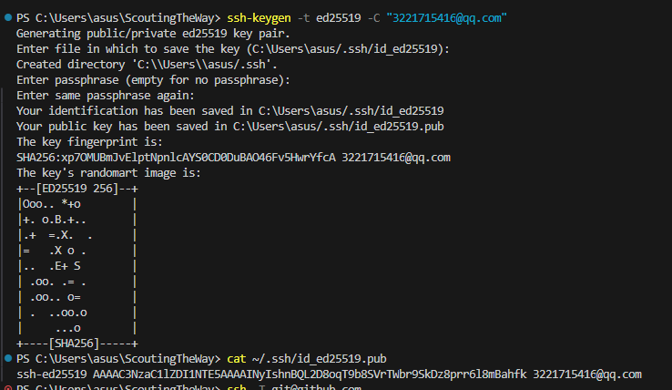

# ScoutingTheWay
## 探索黑路，摸索黑路，勇于冒险！
# 

### 大二下学期又开始重启学习笔记路线了，希望坚持下来。

内容：java为主，算法为辅。

4.14   : 
        进行了vscode和github的联络。
        初次操作时 ： 我用github的网址进行了连接，成功了，但是后来网络之间连不上了,
        gpt说要换ssh进行稳定连接，我在终端运行得到了ssh密钥。 
        
        然后在github的setting中进行配置，连起来了，之后每次进行操作就简单了

        每次更新操作 ： 
        git add .
        git commit -m "注解"
        git push

        每次登录操作 ： 
        git pull 
        source : 我想着在本地修改会更新仓库，但是要是仓库修改，本地估计不会变，问了一下，每次都得指令更新一下。

        
4.14 :  这个真是cs ，难弄。
        好几个小时，差不多了，又加了专用图片文件夹。嘿嘿！

        再次发现问题，c盘放着不爽，
        直接给他删了放d盘
        步骤 ： 
        1.进入d盘目标文件夹输入
        git clone git@github.com:PHYKYSNK/ScoutingTheWay.git
        2.code . (终端路径进入文件夹还得再次打开)

4.15 :  旷英语在寝室找到了第一个github的项目，（是下载的不是自己写的）。
        落雪音乐，好用，得自己找音源，但是官方也给有。

至4.23 ： 中间在学习算法，写算法题，有点耽误时间。
        更改策略，转看黑马java+ai，
因为有点基础，没必要看那么细。韩顺平太细了。